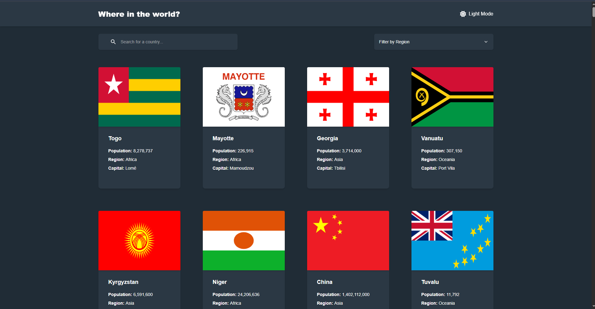
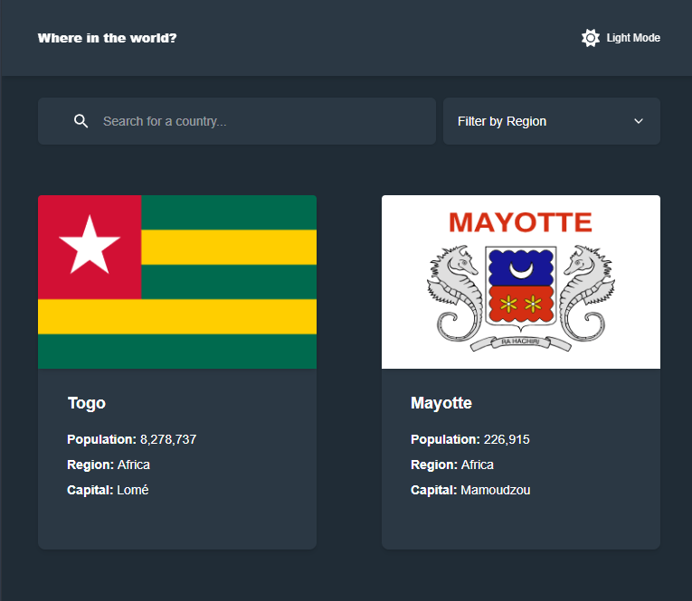
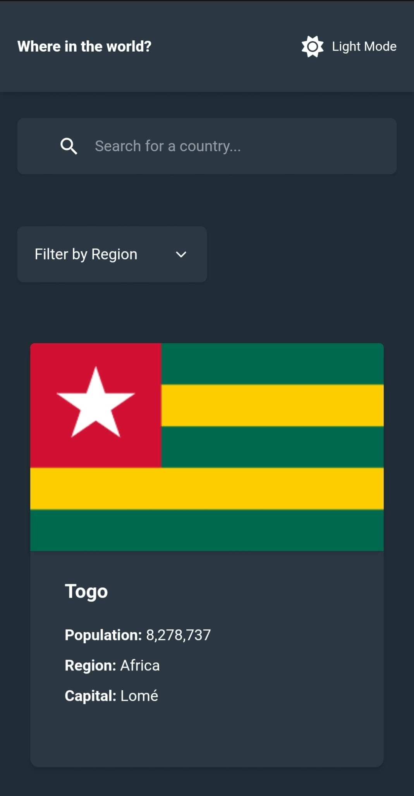

# Frontend Mentor - REST Countries API with color theme switcher solution

This is a solution to the [REST Countries API with color theme switcher challenge on Frontend Mentor](https://www.frontendmentor.io/challenges/rest-countries-api-with-color-theme-switcher-5cacc469fec04111f7b848ca). Frontend Mentor challenges help you improve your coding skills by building realistic projects. 

## Table of contents

- [Overview](#overview)
  - [The challenge](#the-challenge)
  - [Screenshot](#screenshot)
  - [Links](#links)
- [My process](#my-process)
  - [Built with](#built-with)
  - [What I learned](#what-i-learned)
  - [Continued development](#continued-development)
- [Author](#author)

## Overview

### The challenge

Users should be able to:

- See all countries from the API on the homepage
- Search for a country using an `input` field
- Filter countries by region
- Click on a country to see more detailed information on a separate page
- Click through to the border countries on the detail page
- Toggle the color scheme between light and dark mode 

### Screenshot

### Links

- Solution URL: [GitHub](https://github.com/DrakeHermit/rest-countries-api)
- Live Site URL: [Live Site](https://drakehermit-country-flag-api.netlify.app/)

## My process

This is something I will have to work on documenting better on every other project starting from the next challenge I do.
But the process was pretty much the same as any other react project I've done. The only difference is that I used tailwind, react query, and react router for this project.

### Built with

- Semantic HTML5 markup
- Flexbox
- CSS Grid
- Mobile-first workflow
- [React](https://reactjs.org/) - JS library

### What I learned

I genuinely learned a ton working on this project, from routing to using react query to cache the api data I get. I also used react router loaders to fetch data on route load so there was no need for me to use react query in that manner but still react query is an awesome library.

### Continued development

I will keep on working on my craft improving myself with each feature I make. I also need to start documenting my process much more thouroghly than I used to before.

## Author

- Frontend Mentor - [@yourusername](https://www.frontendmentor.io/profile/DrakeHermit)